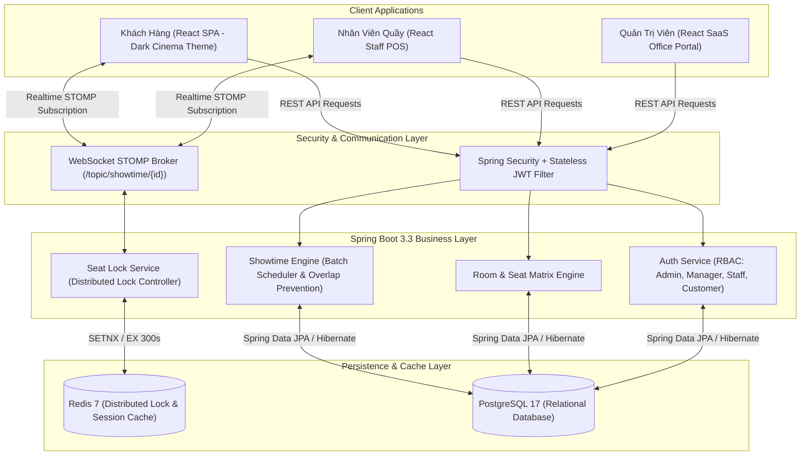

# CineMax - Nền Tảng Đặt Vé & Quản Trị Cụm Rạp Chiếu Phim Realtime

[](https://www.oracle.com/java/)
[](https://spring.io/projects/spring-boot)
[](https://www.postgresql.org/)
[](https://redis.io/)
[](https://react.dev/)
[](https://vitejs.dev/)
[](https://tailwindcss.com/)
[](https://opensource.org/licenses/MIT)

> **CineMax** là một hệ thống web toàn diện phục vụ việc tra cứu phim, xếp lịch chiếu hàng loạt và đặt vé xem phim trực tuyến (lấy cảm hứng từ mô hình CGV, Lotte Cinema). Hệ thống được thiết kế theo chuẩn kiến trúc doanh nghiệp, giải quyết bài toán tải cao, cạnh tranh giữ ghế (Concurrent Seat Holding) bằng **Redis Distributed Lock** và đồng bộ trạng thái ghế thời gian thực bằng **WebSocket STOMP**.

---

## 🌟 Tính Năng & Giải Pháp Kỹ Thuật Nổi Bật

### 1. Khóa Giữ Ghế Phân Tán (Redis Distributed Lock)
- **Vấn đề thực tế:** Khi 2 người dùng (hoặc khách Online và nhân viên Quầy POS) cùng bấm chọn 1 ghế tại cùng 1 tích tắc.
- **Giải pháp:** Sử dụng cơ chế `SETNX` kèm thời gian sống (TTL 300s = 5 phút) trên **Redis**. Ngăn chặn hoàn toàn tình trạng đặt trùng ghế (Double Booking) với độ trễ thấp và hiệu năng cao.

### 2. Đồng Bộ Sơ Đồ Ghế Thời Gian Thực (WebSocket STOMP)
- Tích hợp **Spring WebSocket (SockJS + STOMP)** kết nối hai chiều giữa Server và Client.
- Khi một ghế được giữ (`HOLDING`), đặt thành công (`BOOKED`) hoặc hết hạn nhả ra (`AVAILABLE`), toàn bộ màn hình của các khách hàng khác và nhân viên POS đang xem cùng suất chiếu đó sẽ **tự động đổi màu ghế ngay lập tức** mà không cần tải lại trang.

### 3. Trình Xếp Lịch Chiếu Hàng Loạt (Batch Showtime Scheduling Wizard)
- Khắc phục nhược điểm của các hệ thống cũ (chỉ CRUD từng suất chiếu đơn lẻ).
- Cho phép Quản lý Cụm rạp (Cinema Manager) tạo **toàn bộ lịch chiếu cả tuần (30–50 suất)** chỉ trong 1 lần cấu hình:
  - **Hỗ trợ Giờ lẻ thực tế:** Nhập giờ tự do (`09:15`, `11:40`, `14:05`, `19:20`...).
  - **Công cụ Nối Suất Chiếu Tự Động (Chaining Continuous Generator):** Tự động chia dây chuyền giờ chiếu liên tục từ giờ mở màn (`StartTime + Duration + 15p dọn dẹp rạp + Làm tròn 5p`).
  - **Chính sách Giá Vé Động:** Phân tách cấu hình Giá ngày thường (T2–T5) vs Giá cuối tuần (T6–CN).
  - **Thuật toán Chống Trùng Lịch Chiếu (Overlap Conflict Detection):** Tự động quét và cảnh báo đỏ các khung giờ bị đè nhau trong cùng một phòng chiếu.

### 4. Kiến Trúc Thiết Kế Kép (Dual-Theme Architecture)
- **Phân hệ Khách hàng (Client Facing):** Phong cách **Cinematic Dark Mode** (Đen điện ảnh / Vàng hổ phách) huyền bí, làm nổi bật poster, trailer và mang lại cảm giác đắm chìm như trong rạp chiếu phim.
- **Phân hệ Quản trị (Admin & Manager Portal):** Phong cách **Modern Enterprise SaaS** (Sáng sủa, sắc nét, tương phản cao) theo chuẩn văn phòng làm việc, giúp quản lý giảm mỏi mắt khi làm việc 8h/ngày.

---

## 🏛️ Sơ Đồ Kiến Trúc Hệ Thống (Architecture Workflow)



---

## 📂 Cấu Trúc Dự Án (Project Structure)

```text
cinema-web-app/
├── backend/                              # Spring Boot 3.3 Backend
│   ├── src/main/java/com/cinema/
│   │   ├── config/                       # SecurityConfig, RedisConfig, WebSocketConfig, OpenAPIConfig
│   │   ├── controller/                   # REST API Controllers (Showtime, Room, Seat, Movie, Auth, User...)
│   │   ├── dto/                          # Data Transfer Objects (Type-safe mapping)
│   │   ├── entity/                       # JPA Entities & Enums (RoomType, ShowtimeFormat, SeatStatus...)
│   │   ├── mapper/                       # MapStruct Interface Mappers
│   │   ├── repository/                   # Spring Data JPA Repositories
│   │   └── service/impl/                 # Business Logic & Transactional Services
│   └── src/main/resources/
│       ├── application.properties.example
│       └── application.properties
│
├── frontend/                             # React 19 + Vite 8 Frontend
│   ├── src/
│   │   ├── api/                          # Axios API Client modules (showtimeApi, roomApi, movieApi...)
│   │   ├── components/                   # Reusable UI Components & Common ErrorBoundary
│   │   ├── constants/                    # System Enums (Roles, SeatStatus, RoomTypes)
│   │   ├── context/                      # Global State Context (AuthContext)
│   │   ├── hooks/                        # Custom Hooks (useSeatWebSocket STOMP Client)
│   │   ├── layouts/                      # Layout khung trang (ClientLayout, DashboardLayout)
│   │   │   └── components/               # Sidebar & DashboardHeader công sở
│   │   ├── pages/                        # Màn hình giao diện phân theo Role
│   │   │   ├── admin/                    # Admin/Manager (Showtime Wizard, Cinema, Room, Seat Matrix, Users)
│   │   │   ├── auth/                     # Login & Register
│   │   │   ├── client/                   # LandingPage, MovieDetail (Phụ đề/Lồng tiếng), BookingSeat
│   │   │   └── staff/                    # StaffPOSPage (Quầy bán vé Realtime)
│   │   ├── routes/                       # AppRoutes & Role-based ProtectedRoute
│   │   ├── utils/                        # Formatters (Tiền tệ VND, Ngày tháng, Thời lượng)
│   │   ├── App.jsx
│   │   └── main.jsx
│   ├── .env.example                      # Mẫu biến môi trường frontend
│   ├── jsconfig.json                     # Cấu hình Path Alias (@/*)
│   ├── tailwind.config.js
│   └── vite.config.js                    # Cấu hình Vite & SockJS Polyfill
│
└── docs/                                 # Tài liệu kỹ thuật chi tiết
    ├── DATABASE.md                       # Sơ đồ CSDL Entity Relationship (Mermaid)
    ├── DESIGN.md                         # Quy chuẩn Design System (Dual-Theme Specifications)
    ├── PRODUCT.md                        # Đặc tả Yêu cầu Nghiệp vụ (SRS)
    ├── TECH_STACK.md                     # Quy chuẩn Tech Stack & API Response
    └── GIT_CONVENTIONS.md                # Quy chuẩn Commit Code chuẩn quốc tế
```

---

## 🛠️ Công Nghệ Sử Dụng (Tech Stack)

### Backend
| Công nghệ | Phiên bản | Vai trò |
| :--- | :--- | :--- |
| **Java** | 17 (LTS) | Ngôn ngữ phát triển chính |
| **Spring Boot** | 3.3.0 | Framework nền tảng backend |
| **Spring Security** | 6.x | Phân quyền và bảo mật hệ thống |
| **JWT (JJWT)** | 0.11.5 | Xác thực không lưu phiên (Stateless Auth) |
| **Spring Data JPA / Hibernate** | 3.3.0 | ORM kết nối cơ sở dữ liệu |
| **PostgreSQL** | 17 | Hệ quản trị cơ sở dữ liệu quan hệ |
| **Redis** | 7.x | Distributed Lock (Khóa giữ ghế) & Caching |
| **Spring WebSocket + SockJS** | 3.3.0 | Giao thức truyền tin hai chiều STOMP |
| **MapStruct** | 1.5.5 | Mapping Entity $\longleftrightarrow$ DTO Type-safe |
| **SpringDoc OpenAPI** | 2.5.0 | Tự động tạo Swagger UI API Documentation |

### Frontend
| Công nghệ | Phiên bản | Vai trò |
| :--- | :--- | :--- |
| **React** | 19.x | Thư viện xây dựng giao diện Single Page App |
| **Vite** | 8.x | Build tool & Dev server siêu tốc |
| **Tailwind CSS** | v4.x | Utility-first CSS framework |
| **React Router DOM** | v7.x | Quản lý định tuyến và phân quyền Route |
| **Axios** | 1.7.x | HTTP Client kèm JWT Interceptor |
| **@stomp/stompjs + SockJS** | 7.x | WebSocket client kết nối Realtime |

---

## 🚀 Hướng Dẫn Cài Đặt & Khởi Chạy (Getting Started)

### Yêu Cầu Môi Trường (Prerequisites)
- **Java JDK:** 17 trở lên
- **Apache Maven:** 3.8+
- **Node.js:** 20.x trở lên & **npm** 10+
- **PostgreSQL Server:** Port `5432` hoặc `5433`
- **Redis Server:** Port `6379`

---

### Bước 1: Khởi Chạy Backend (Spring Boot)

1. Di chuyển vào thư mục backend:
   ```bash
   cd backend
   ```

2. Tạo file cấu hình từ file mẫu:
   ```bash
   cp src/main/resources/application.properties.example src/main/resources/application.properties
   ```

3. Cấu hình thông số Database & Redis trong `application.properties`:
   ```properties
   spring.datasource.url=jdbc:postgresql://localhost:5433/cinemadb
   spring.datasource.username=postgres
   spring.datasource.password=postgres

   spring.data.redis.host=localhost
   spring.data.redis.port=6379

   application.security.jwt.secret-key=404E635266556A586E3272357538782F413F4428472B4B6250645367566B5970
   application.security.jwt.expiration=86400000
   ```

4. Biên dịch và khởi chạy server:
   ```bash
   mvn clean spring-boot:run
   ```
   - API Backend chạy tại: `http://localhost:8080`
   - Swagger UI tài liệu API: `http://localhost:8080/swagger-ui.html`
   - WebSocket STOMP Endpoint: `http://localhost:8080/ws`

---

### Bước 2: Khởi Chạy Frontend (React + Vite)

1. Di chuyển vào thư mục frontend:
   ```bash
   cd frontend
   ```

2. Tạo file biến môi trường từ file mẫu:
   ```bash
   cp .env.example .env
   ```

3. Cài đặt các gói phụ thuộc (Dependencies):
   ```bash
   npm install
   ```

4. Khởi chạy môi trường phát triển:
   ```bash
   npm run dev
   ```
   - Giao diện Client & Admin chạy tại: `http://localhost:5173`

---

## 👥 Tài Khoản Mặc Định (Demo Accounts)

Hệ thống tự động khởi tạo dữ liệu mẫu khi chạy lần đầu:

| Tên Đăng Nhập | Mật Khẩu | Quyền Hạn (Role) | Chức Năng Chính |
| :--- | :--- | :--- | :--- |
| `admin` | `admin123` | `ADMIN` (Super Admin) | Toàn quyền quản trị hệ thống, quản lý rạp, phim, phân quyền user |
| `manager_landmark` | `manager123` | `MANAGER` (Cinema Manager) | Quản lý phòng chiếu, sơ đồ ghế và xếp lịch suất chiếu cụm rạp Landmark |
| `staff_pos` | `staff123` | `STAFF` (POS Staff) | Quầy bán vé trực tiếp tại rạp, giữ ghế và in vé |
| `customer` | `customer123` | `CUSTOMER` (Thành viên) | Xem phim, chọn định dạng (2D Phụ đề / Lồng tiếng) và đặt vé online |

---

## 📜 Giấy Phép (License)

Dự án được phân phối dưới giấy phép mã nguồn mở **MIT License**. Xem chi tiết tại [LICENSE](LICENSE).
