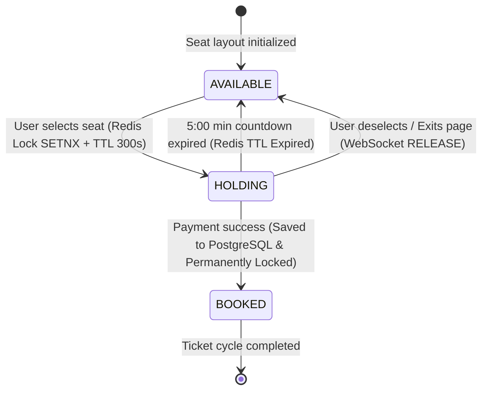
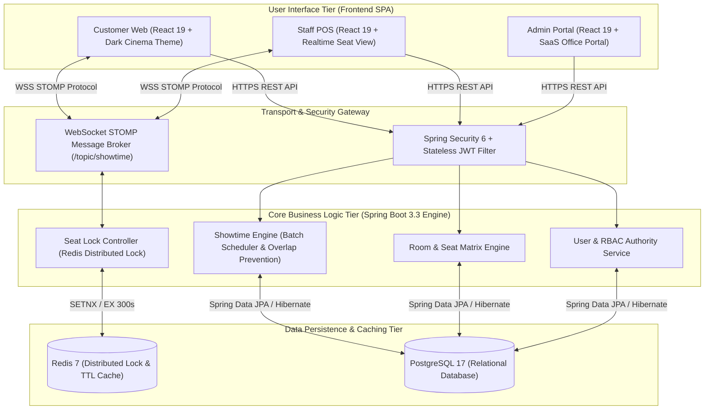

# CineMax - System & Business Requirements Specification (SRS)
> **Real-Time Online Cinema Ticket Booking & Multi-Cinema Management System**  
> *Document Version:* `2.1.0` | *Status:* `Production-Ready` | *Standard:* `Enterprise SRS / BRD`

---

## 📌 1. Business Scope & Objectives

The **CineMax** system is designed to comprehensively solve core operational challenges faced by modern cinema chains (comparable to CGV or Lotte Cinema operational models):

1. **Seat Contention & Concurrency:**  
   Occurs when hundreds of online users and counter booking staff (Staff POS) simultaneously access and attempt to select the exact same seat during peak hours ("Golden Hours", blockbuster movie releases). The system strictly eliminates double bookings with minimal latency.
2. **Real-World Batch Showtime Scheduling Complexity:**  
   In practice, cinema managers do not create isolated individual showtimes. Instead, they schedule dozens of auditoriums throughout an entire week. Actual showtimes have non-standard durations (`09:15`, `11:40`, `14:05`...), require room cleanup buffers (e.g., 15 minutes), and demand automatic overlap detection algorithms within auditorium schedules.
3. **Multi-Cinema Role-Based Access Control (Multi-Cinema RBAC):**  
   Strictly separates authority between Super Administrators (nationwide system management) and Cinema Managers (restricted management of rooms, seat matrices, and showtime schedules assigned strictly to their allocated cinema branch).

---

## 🎯 2. Functional Requirements (FR)

### 2.1. Customer Experience & Online Booking

| Requirement ID | Feature Name | Detailed Business Specification |
| :--- | :--- | :--- |
| **`REQ-FR-01.1`** | **Movie Catalog Lookup** | - Display lists of **Now Showing** and **Coming Soon** movies. - Provide detailed information: High-resolution Posters, YouTube Trailers, Duration, Director, Cast, and Age Rating classifications (`P`, `K`, `T13`, `T16`, `T18`). |
| **`REQ-FR-01.2`** | **Multi-Dimensional Schedule Filter** | - Customers filter showtimes by: **Viewing Date** (next 7 days), **Region** (North, Central, South), and **Specific Cinema Branch**. - Display available showtime counts dynamically per day. |
| **`REQ-FR-01.3`** | **Format & Version Grouping** | - Visually group showtime slots by experience format:   + **2D Subtitle** (`TWO_D_SUB`)   + **2D Dubbed** (`TWO_D_DUB`)   + **IMAX 2D Subtitle** (`IMAX_TWO_D`) - Customer selects time slot $\rightarrow$ System automatically redirects to the correct auditorium seat map. |
| **`REQ-FR-01.4`** | **Real-Time Seat Map & Lock** | - Display visual seat layout mimicking standard curved cinema screens. - Visually differentiate 3 seat categories: **Standard**, **VIP** (central area), and **Couple** (Sweetbox double seats). - Integrated **05:00 minute countdown timer** for temporary seat reservations. |
| **`REQ-FR-01.5`** | **Booking & E-Ticket Generation** | - Detailed invoice summary (Movie Title, Showtime, Auditorium, Seat List, Total Price). - Generate digital E-Tickets with **QR Codes** for entrance scanning. |

---

### 2.2. Counter Booking System (Staff POS)

| Requirement ID | Feature Name | Detailed Business Specification |
| :--- | :--- | :--- |
| **`REQ-FR-02.1`** | **Optimized POS Counter Interface** | - High-speed interface tailored for box office staff. - Quick showtime search and instant direct seat selection upon customer request. |
| **`REQ-FR-02.2`** | **Two-Way Real-Time Seat Sync** | - Instant notification via **WebSocket** when seats are selected or released by online customers. - Lock seats directly at the counter and immediately sync updates to online customer screens. |
| **`REQ-FR-02.3`** | **On-Site Ticketing & Invoicing** | - Update seat status to **Booked (`BOOKED`)** instantly upon cash/card payment confirmation. - Support physical ticket printing and QR code entry verification. |

---

### 2.3. Cinema Manager Portal

| Requirement ID | Feature Name | Detailed Business Specification |
| :--- | :--- | :--- |
| **`REQ-FR-03.1`** | **Auditorium Management** | - Manage auditoriums belonging strictly to the assigned cinema branch. - Standardize 3 auditorium technology types: **`STANDARD`**, **`IMAX`**, **`GOLD_CLASS`**. - Automatically update total seat capacity per auditorium. |
| **`REQ-FR-03.2`** | **Visual Seat Matrix Designer** | - Automated grid generation by Row letters (A, B, C...) $\times$ Column numbers (1, 2, 3...). - Single-click toggle between seat types (`Standard` $\rightarrow$ `VIP` $\rightarrow$ `Couple` $\rightarrow$ `Hidden/Aisle`). - Automatic fare multiplier assignment based on seat type. |
| **`REQ-FR-03.3`** | **Batch Showtime Wizard** | - **Multi-Dimensional Configuration:** Select Movie + Format, select one or multiple auditoriums, date range (From $\rightarrow$ To), and applicable days of the week. - **Irregular Time & Auto-Chaining Generator:** Automatically compute continuous showtime series starting from opening time (`StartTime + Duration + 15m Buffer + 5m Rounding`). - **Dynamic Pricing Policy:** Separate pricing rules for Weekdays (Mon–Thu) vs Weekends (Fri–Sun). - **Overlap Conflict Detection Algorithm:** Automatically identify and warn against overlapping time windows in the same auditorium. |

---

### 2.4. System Administration Portal (Super Admin)

| Requirement ID | Feature Name | Detailed Business Specification |
| :--- | :--- | :--- |
| **`REQ-FR-04.1`** | **Nationwide Cinema Chain Management** | - Manage national cinema branches, addresses, hotlines, and operational regions. - Toggle active/inactive operational status per cinema branch system-wide. |
| **`REQ-FR-04.2`** | **National Movie Catalog Management** | - Create and edit movie details, directors, cast, age ratings, and trailers. - Integrate **Cloudinary** cloud service for uploading and optimizing movie poster assets. |
| **`REQ-FR-04.3`** | **User Management & RBAC** | - Manage user accounts across the system. - Grant Super Admin privileges, create Cinema Manager accounts assigned to specific branches, and provision Staff POS accounts. |

---

## ⚡ 3. Non-Functional Requirements (NFR)

### 3.1. Concurrency & Transactional Locking
- **`REQ-NFR-01.1` (Distributed Seat Lock):** Utilize **Redis Distributed Lock** powered by atomic `SETNX` commands with Time-To-Live (TTL = 300 seconds). Guarantees 100% prevention of race conditions when multiple users attempt to select the same seat concurrently.
- **`REQ-NFR-01.2` (Transactional Integrity):** All batch scheduling and booking operations are wrapped within `@Transactional` context, ensuring strict compliance with ACID properties (All-or-Nothing execution).

### 3.2. Real-Time Latency
- **`REQ-NFR-02.1` (WebSocket Communication):** Use **WebSocket STOMP** protocol with a Pub/Sub message broker listening on `/topic/showtime/{id}`.
- **`REQ-NFR-02.2` (Message Broadcast):** Whenever a seat state changes (`HOLDING`, `BOOKED`, `AVAILABLE`), events are broadcast to all connected clients with latency **under 50ms**.

### 3.3. Security & Access Control
- **`REQ-NFR-03.1` (Stateless Authentication):** Powered by **Spring Security 6** integrated with **JSON Web Token (JWT)** for stateless authentication.
- **`REQ-NFR-03.2` (Credential Protection):** All user passwords are encrypted using the **BCrypt** hashing algorithm.
- **`REQ-NFR-03.3` (DTO & Data Layer Isolation):** JPA Entities are strictly prohibited from being exposed via Controller APIs. 100% of data transfer is mediated through dedicated DTO objects mapped via **MapStruct**.

### 3.4. Dual-Theme User Experience Architecture
- **`REQ-NFR-04.1` (Client-Facing Interface):** Implements a **Cinematic Dark Mode** theme (Black `#000000` / Amber `#F59E0B`) creating an immersive movie theater ambience that highlights posters and trailers.
- **`REQ-NFR-04.2` (Management Portal):** Implements a **Modern Enterprise SaaS** design (Light Grey `#F8FAFC`, Crisp White Cards `#FFFFFF`, Dark Slate text `#0F172A`, Corporate Blue accent `#2563EB`) providing high contrast, reduced eye fatigue, and optimal productivity for 8-hour daily administration workflows.

---

## 🔄 4. Seat State Machine Lifecycle

---

## 👥 5. RBAC Permission Matrix

| Feature Category | Customer (`CUSTOMER`) | Counter Staff (`STAFF`) | Cinema Manager (`MANAGER`) | Super Admin (`ADMIN`) |
| :--- | :---: | :---: | :---: | :---: |
| Browse Movies, Showtimes & Trailers | ✅ | ✅ | ✅ | ✅ |
| Select Seats & Online Booking (5m Hold) | ✅ | ❌ | ❌ | ✅ |
| Counter Ticket Sales (Staff POS) | ❌ | ✅ | ✅ | ✅ |
| Auditoriums & Seat Matrix Management | ❌ | ❌ | ✅ *(Assigned Branch)* | ✅ *(System-Wide)* |
| Batch Showtime Creation & Deletion | ❌ | ❌ | ✅ *(Assigned Branch)* | ✅ *(System-Wide)* |
| Nationwide Cinema Catalog Management | ❌ | ❌ | ❌ | ✅ |
| Movie Catalog & Poster Asset Upload | ❌ | ❌ | ❌ | ✅ |
| User Account & RBAC Management | ❌ | ❌ | ❌ | ✅ |

---

## 🏗️ 6. Technology Stack Architecture

