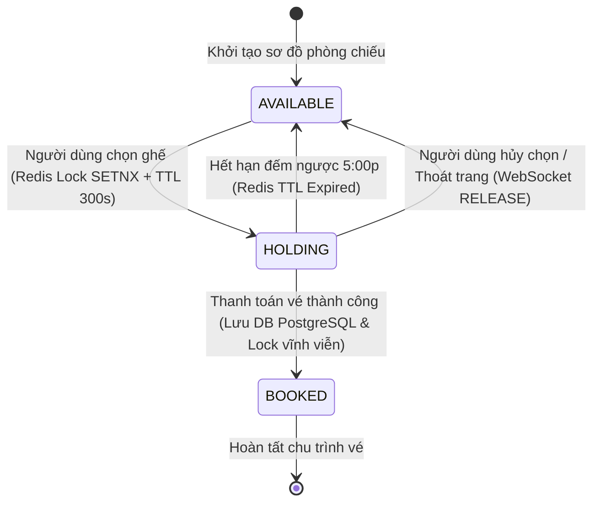
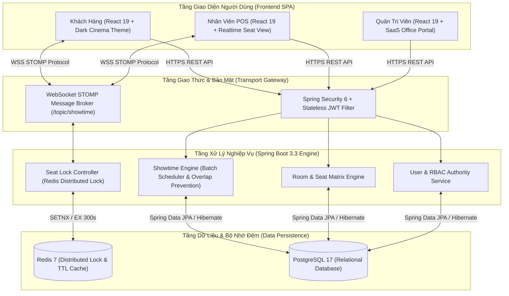

# CineMax - Bản Đặc Tả Yêu Cầu Hệ Thống & Nghiệp Vụ (SRS)
> **Hệ Thống Đặt Vé & Quản Trị Cụm Rạp Chiếu Phim Trực Tuyến Thời Gian Thực**  
> *Phiên bản tài liệu:* `2.1.0` | *Trạng thái:* `Production-Ready` | *Tiêu chuẩn:* `Enterprise SRS / BRD`

---

## 📌 1. Bối Cảnh Nghiệp Vụ & Mục Tiêu Hệ Thống (Business Scope)

Hệ thống **CineMax** được thiết kế nhằm giải quyết toàn diện các thách thức vận hành cốt lõi của các chuỗi rạp chiếu phim hiện đại (tương đương mô hình CGV, Lotte Cinema):

1. **Thách thức Cạnh tranh Giữ Ghế (Seat Contention & Concurrency):**  
   Xảy ra khi hàng trăm người dùng Online và các nhân viên tại Quầy bán vé (Staff POS) cùng truy cập và chọn cùng một vị trí ghế vào các khung giờ cao điểm ("Giờ Vàng", phim bom tấn). Hệ thống bắt buộc phải giải quyết triệt để vấn đề đặt trùng (Double Booking) với độ trễ tối thiểu.
2. **Thách thức Xếp Lịch Chiếu Thực Tế (Batch Scheduling Complexity):**  
   Trong thực tế, quản lý rạp không tạo từng suất chiếu đơn lẻ mà phải lên lịch cho hàng chục phòng chiếu trong suốt cả tuần. Các khung giờ chiếu thực tế có độ dài lẻ tự do (`09:15`, `11:40`, `14:05`...), cần thời gian dọn phòng (Buffer) và cần cơ chế tự động phát hiện xung đột trùng giờ trong phòng chiếu.
3. **Thách thức Phân Quyền Đa Cụm Rạp (Multi-Cinema RBAC):**  
   Phân định rõ quyền hạn giữa Quản trị viên cấp cao (Super Admin - quản lý toàn quốc) và Quản lý Cụm Rạp (Cinema Manager - chỉ quản lý phòng và lịch chiếu thuộc cụm rạp được phân bổ).

---

## 🎯 2. Yêu Cầu Chức Năng (Functional Requirements - FR)

### 2.1. Phân Hệ Khách Hàng (Customer Experience & Online Booking)

| Mã Yêu Cầu | Tên Chức Năng | Đặc Tả Nghiệp Vụ Chi Tiết |
| :--- | :--- | :--- |
| **`REQ-FR-01.1`** | **Tra Cứu Danh Mục Phim** | - Hiển thị danh sách phim **Đang Chiếu (Now Showing)** và **Sắp Chiếu (Coming Soon)**. - Cung cấp thông tin chi tiết: Poster độ phân giải cao, Trailer YouTube, Thời lượng, Đạo diễn, Diễn viên và Giới hạn độ tuổi (`P`, `K`, `T13`, `T16`, `T18`). |
| **`REQ-FR-01.2`** | **Bộ Lọc Lịch Chiếu Đa Chiều** | - Khách hàng lọc lịch chiếu theo: **Ngày xem** (7 ngày kế tiếp), **Khu vực** (Miền Bắc, Miền Trung, Miền Nam), và **Cụm rạp cụ thể**. - Hiển thị số lượng suất chiếu khả dụng tương ứng theo từng ngày. |
| **`REQ-FR-01.3`** | **Phân Nhóm Phiên Bản & Định Dạng** | - Gom nhóm trực quan các khung giờ chiếu theo định dạng phiên bản:   + **2D Phụ đề** (`TWO_D_SUB`)   + **2D Lồng tiếng** (`TWO_D_DUB`)   + **IMAX 2D Phụ đề** (`IMAX_TWO_D`) - Khách hàng chọn giờ chiếu $\rightarrow$ Hệ thống tự động điều hướng vào đúng phòng chiếu tương ứng. |
| **`REQ-FR-01.4`** | **Sơ Đồ Ghế & Giữ Ghế Realtime** | - Hiển thị sơ đồ ghế mô phỏng màn hình cong chuẩn rạp. - Phân biệt trực quan 3 loại ghế: **Standard** (Ghế thường), **VIP** (Ghế trung tâm), **Couple** (Ghế đôi Sweetbox). - Tích hợp đồng hồ đếm ngược **05:00 phút** cho phiên giữ ghế. |
| **`REQ-FR-01.5`** | **Đặt Vé & Xuất Vé Điện Tử (E-Ticket)** | - Tóm tắt chi tiết hóa đơn (Tên phim, Suất chiếu, Phòng chiếu, Danh sách ghế, Tổng tiền). - Sinh mã vé điện tử kèm **Mã QR Code** phục vụ việc soát vé tại cổng rạp. |

---

### 2.2. Phân Hệ Quầy Bán Vé Trực Tiếp (Staff POS System)

| Mã Yêu Cầu | Tên Chức Năng | Đặc Tả Nghiệp Vụ Chi Tiết |
| :--- | :--- | :--- |
| **`REQ-FR-02.1`** | **Giao Diện Quầy POS Tối Ưu** | - Thiết kế giao diện thao tác nhanh cho nhân viên bán vé tại quầy. - Tìm kiếm suất chiếu nhanh chóng, chọn ghế trực tiếp theo yêu cầu của khách tại quầy. |
| **`REQ-FR-02.2`** | **Đồng Bộ Ghế 2 Chiều Thời Gian Thực** | - Nhận thông báo tức thời qua **WebSocket** khi có ghế được khách online chọn hoặc nhả ra. - Khóa ghế trực tiếp tại quầy và đồng bộ ngay lập tức lên màn hình của khách online. |
| **`REQ-FR-02.3`** | **Xuất Vé & In Hóa Đơn Tại Quầy** | - Chuyển trạng thái ghế sang **Đã Bán (`BOOKED`)** ngay khi thanh toán tiền mặt/quẹt thẻ thành công. - Hỗ trợ in vé cứng và mã QR kiểm soát vào phòng chiếu. |

---

### 2.3. Phân Hệ Quản Lý Cụm Rạp (Cinema Manager Portal)

| Mã Yêu Cầu | Tên Chức Năng | Đặc Tả Nghiệp Vụ Chi Tiết |
| :--- | :--- | :--- |
| **`REQ-FR-03.1`** | **Quản Lý Phòng Chiếu** | - Quản lý danh sách phòng chiếu thuộc cụm rạp được phân bổ. - Chuẩn hóa 3 loại công nghệ phòng chiếu: **`STANDARD`**, **`IMAX`**, **`GOLD_CLASS`**. - Tự động cập nhật tổng sức chứa ghế của phòng. |
| **`REQ-FR-03.2`** | **Thiết Kế Ma Trận Sơ Đồ Ghế (Visual Seat Matrix)** | - Công cụ tạo lưới tự động theo Số hàng (A, B, C...) $\times$ Số cột (1, 2, 3...). - Cho phép click chuột để chuyển đổi nhanh loại ghế (`Standard` $\rightarrow$ `VIP` $\rightarrow$ `Couple` $\rightarrow$ `Ẩn/Lối đi`). - Tự động gán hệ số giá vé theo loại ghế. |
| **`REQ-FR-03.3`** | **Trình Xếp Lịch Chiếu Hàng Loạt (Batch Showtime Wizard)** | - **Cấu hình Đa Chiều:** Chọn Phim + Định dạng, Chọn 1 hoặc nhiều phòng chiếu, Chọn khoảng ngày (From $\rightarrow$ To), Chọn các thứ áp dụng trong tuần. - **Hỗ trợ Giờ lẻ & Công cụ Nối Suất Chiếu Tự Động (Chaining Generator):** Tự động tính chuỗi giờ chiếu liên tục từ giờ mở màn (`StartTime + Duration + 15p dọn phòng + Làm tròn 5 phút`). - **Chính sách Giá Vé Động:** Phân tách cấu hình Giá ngày thường (T2–T5) vs Giá cuối tuần (T6–CN). - **Thuật toán Chống Trùng Lịch (Overlap Conflict Detection):** Tự động phát hiện và cảnh báo các khung giờ bị giao nhau trong cùng một phòng chiếu. |

---

### 2.4. Phân Hệ Quản Trị Hệ Thống (Super Admin Portal)

| Mã Yêu Cầu | Tên Chức Năng | Đặc Tả Nghiệp Vụ Chi Tiết |
| :--- | :--- | :--- |
| **`REQ-FR-04.1`** | **Quản Lý Danh Mục Cụm Rạp Toàn Quốc** | - Quản lý danh sách cụm rạp, địa chỉ, hotline và khu vực hoạt động. - Bật/tắt trạng thái hoạt động (Active/Inactive) của từng cụm rạp trên toàn hệ thống. |
| **`REQ-FR-04.2`** | **Quản Lý Danh Mục Phim Quốc Gia** | - Thêm mới, chỉnh sửa thông tin phim, đạo diễn, diễn viên, độ tuổi và trailer. - Tích hợp dịch vụ đám mây **Cloudinary** để upload và tối ưu hóa hình ảnh Poster phim. |
| **`REQ-FR-04.3`** | **Phân Quyền & Quản Trị Tài Khoản (RBAC)** | - Quản lý danh sách tài khoản người dùng. - Cấp quyền Super Admin, tạo tài khoản Manager và gán quyền quản lý cụm rạp cụ thể, tạo tài khoản nhân viên Staff POS. |

---

## ⚡ 3. Yêu Cầu Phi Chức Năng (Non-Functional Requirements - NFR)

### 3.1. Hiệu Năng & Xử Lý Đồng Thời (Concurrency & Locking)
- **`REQ-NFR-01.1` (Distributed Seat Lock):** Sử dụng cơ chế khóa phân tán **Redis Distributed Lock** với lệnh nguyên tử `SETNX` kèm thời gian sống (TTL = 300 giây). Ngăn chặn 100% tình trạng hai người dùng đặt cùng một ghế tại cùng một thời điểm.
- **`REQ-NFR-01.2` (Transactional Integrity):** Toàn bộ các thao tác tạo lịch chiếu hàng loạt hoặc tạo vé đặt phải được bọc trong `@Transactional`, đảm bảo nguyên tắc ACID (All-or-Nothing).

### 3.2. Độ Trễ Thời Gian Thực (Realtime Latency)
- **`REQ-NFR-02.1` (WebSocket Communication):** Sử dụng giao thức **WebSocket STOMP** với đường truyền Pub/Sub theo kênh `/topic/showtime/{id}`.
- **`REQ-NFR-02.2` (Message Broadcast):** Khi trạng thái ghế thay đổi (`HOLDING`, `BOOKED`, `AVAILABLE`), sự kiện phải được broadcast đến tất cả các client đang kết nối với độ trễ **dưới 50ms**.

### 3.3. Bảo Mật & Xác Thực (Security & RBAC)
- **`REQ-NFR-03.1` (Stateless Authentication):** Sử dụng **Spring Security 6** kết hợp với **JSON Web Token (JWT)** để xác thực không lưu phiên.
- **`REQ-NFR-03.2` (Credential Protection):** Toàn bộ mật khẩu người dùng phải được băm bảo mật bằng thuật toán **BCrypt**.
- **`REQ-NFR-03.3` (DTO & Data Layer Isolation):** Tuyệt đối không trả trực tiếp JPA Entity ra Controller API. 100% dữ liệu truyền nhận phải thông qua các đối tượng DTO chuyên biệt được ánh xạ bằng **MapStruct**.

### 3.4. Kiến Trúc Thiết Kế Giao Diện (Dual-Theme UX Architecture)
- **`REQ-NFR-04.1` (Client Facing):** Áp dụng phong cách **Cinematic Dark Mode** (Tông đen `#000000` / Vàng Amber `#F59E0B`) tạo cảm giác rạp phim huyền bí, làm nổi bật poster và trailer.
- **`REQ-NFR-04.2` (Management Portal):** Áp dụng phong cách **Modern Enterprise SaaS** (Nền xám sáng `#F8FAFC`, thẻ trắng `#FFFFFF`, chữ đen `#0F172A`, màu nhấn xanh công sở `#2563EB`) với độ tương phản cao, chống mỏi mắt và tối ưu hóa năng suất làm việc 8h/ngày cho nhân sự quản trị.

---

## 🔄 4. Mô Hình Chu Trình Sống Của Ghế (Seat State Machine)

---

## 👥 5. Ma Trận Phân Quyền Hệ Thống (RBAC Permission Matrix)

| Danh Mục Chức Năng | Khách Hàng (`CUSTOMER`) | Nhân Viên Quầy (`STAFF`) | Quản Lý Cụm Rạp (`MANAGER`) | Super Admin (`ADMIN`) |
| :--- | :---: | :---: | :---: | :---: |
| Tra cứu phim, lịch chiếu & xem trailer | ✅ | ✅ | ✅ | ✅ |
| Chọn ghế & Đặt vé Online (Giữ ghế 5p) | ✅ | ❌ | ❌ | ✅ |
| Bán vé trực tiếp tại quầy (Staff POS) | ❌ | ✅ | ✅ | ✅ |
| Quản lý Phòng chiếu & Sơ đồ ghế | ❌ | ❌ | ✅ *(Trong cụm rạp)* | ✅ *(Toàn hệ thống)* |
| Tạo & Xóa Lịch chiếu (Batch Wizard) | ❌ | ❌ | ✅ *(Trong cụm rạp)* | ✅ *(Toàn hệ thống)* |
| Quản lý Danh mục Cụm rạp toàn quốc | ❌ | ❌ | ❌ | ✅ |
| Quản lý Danh mục Phim & Upload Poster | ❌ | ❌ | ❌ | ✅ |
| Quản lý Người dùng & Cấp quyền RBAC | ❌ | ❌ | ❌ | ✅ |

---

## 🏗️ 6. Ngăn Xếp Công Nghệ Chuẩn Hóa (Technology Stack)

---

## 📜 7. Tài Liệu Kỹ Thuật Tham Chiếu (Reference Documents)

- 📄 **[docs/DATABASE.md](docs/DATABASE.md):** Sơ đồ quan hệ thực thể (Entity Relationship Diagram - Mermaid) và từ điển dữ liệu.
- 🎨 **[docs/DESIGN.md](docs/DESIGN.md):** Đặc tả quy chuẩn Design System Kiến trúc Kép (Dual-Theme Architecture).
- 📋 **[docs/PRODUCT.md](docs/PRODUCT.md):** Bản mô tả yêu cầu sản phẩm chi tiết.
- 💻 **[docs/TECH_STACK.md](docs/TECH_STACK.md):** Quy chuẩn tiêu chuẩn kỹ thuật & định dạng API Response.
- 🌿 **[docs/GIT_CONVENTIONS.md](docs/GIT_CONVENTIONS.md):** Quy chuẩn quản lý mã nguồn và định dạng commit quốc tế.
- 📜 **[CHANGELOG.md](CHANGELOG.md):** Nhật ký thay đổi và lịch sử nâng cấp hệ thống theo thời gian thực.
