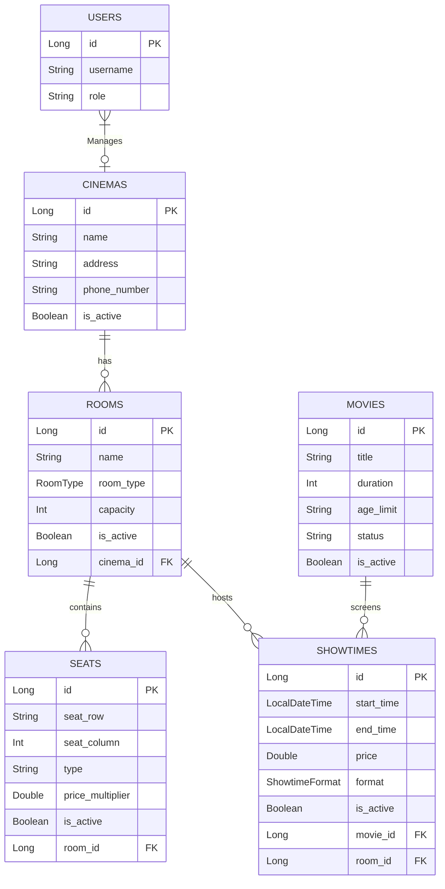

# Cấu trúc Cơ sở dữ liệu (Database Schema)

> **QUY TẮC BẮT BUỘC CHO AI:** 
> 1. Luôn đọc file này trước khi viết các câu lệnh SQL hoặc tạo Entity.
> 2. Mỗi khi có sự thay đổi về cấu trúc bảng (thêm/sửa/xóa bảng hoặc cột), AI **BẮT BUỘC** phải cập nhật lại biểu đồ Mermaid dưới đây.

## Sơ đồ Thực thể (Entity Relationship Diagram)

